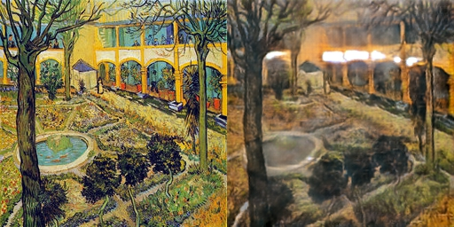
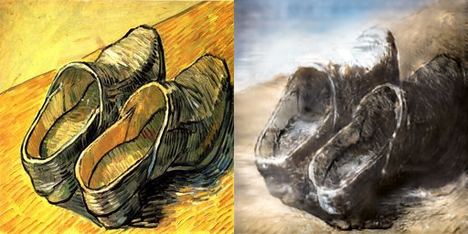
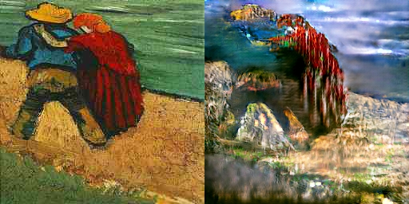

# CycleGAN
This is a tensorflow implementation of [CycleGAN](https://junyanz.github.io/CycleGAN/). 

## Output Example
I tested the model on 'vangogh2photo' and following are 80-epoch training results.
It turns out it needs more training(They trained for 200 epochs with decaying learning rate in the paper.)

| vangogh -> photo |
| :--------------: |
|  |
|  |
|  |

| photo -> vangogh |
| :--------------: |
|  |
|  |
|  |

## Usage
To train model(download dataset autonomously):

    $ python main.py --name=[choose one in the following list]
    
    available_names = [
        'ae_photos',
        'apple2orange',
        'summer2winter_yosemite',
        'horse2zebra',
        'monet2photo',
        'cezanne2photo',
        'ukiyoe2photo',
        'vangogh2photo',
        'maps',
        'cityscapes',
        'facades',
        'iphone2dslr_flower',
    ]
    
To test model:

    $ python main.py --phase=test

## Environment
- python (3.5.3)
- tensorflow-gpu (1.1.0)
- requests (2.13.0)
